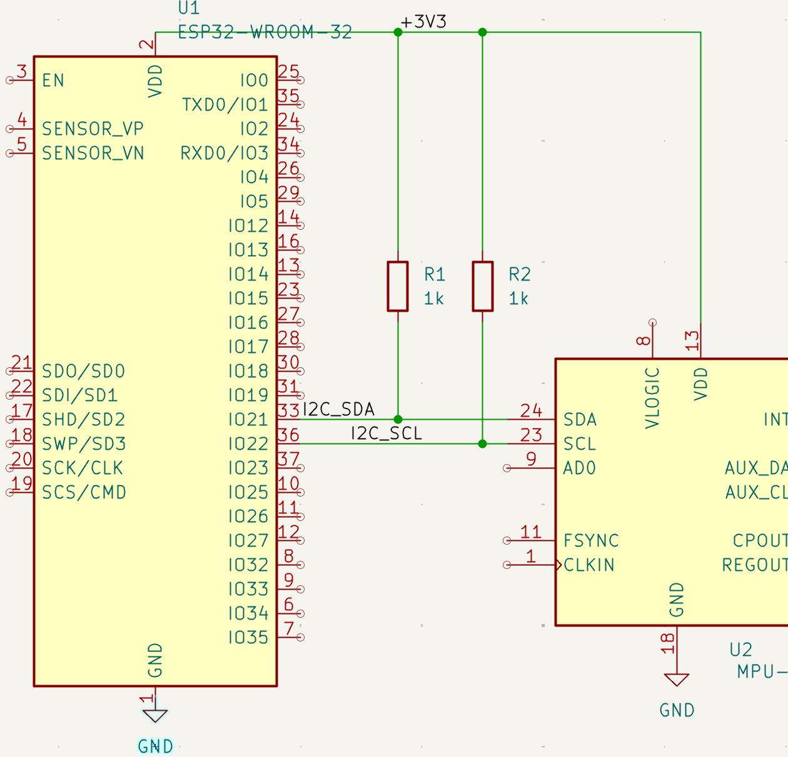

# Architon CLI (rv)

[](https://github.com/badimirzai/architon-cli/actions/workflows/ci.yaml) [](https://github.com/badimirzai/architon-cli/releases)

Fail fast on hardware integration mistakes before you build the board.

Architon is deterministic hardware architecture verification for robotics and embedded systems. It runs before PCB fabrication and firmware bring-up to catch electrical compatibility, power, logic-level, and integration failures early.

---

## Demo on Real KiCad Project

Architon detects electrical contract violations directly from KiCad projects before bring-up.
Run Architon on a real hardware design and detect an integration failure:


Architon detects integration failures deterministically before hardware is built.


Architon detects invalid I2C pull-up resistance before bring-up.

---

## What Architon verifies

Architon validates system-level compatibility between components, including:

- Supply voltage compatibility
- Driver and motor electrical compatibility
- Power rail capacity and margin
- Logic voltage compatibility
- I2C address conflicts
- Current margin and stall load conditions

Architon currently focuses on deterministic verification for embedded and robotics electrical architecture, KiCad import, and CI-safe reporting. See [docs/supported-configurations.md](docs/supported-configurations.md).

---

## Why Architon exists

Software has compilers and static analysis.
Hardware lacks a deterministic **system-level** verification step before fabrication.

Architon fills this gap by enforcing architecture contracts across **power, interfaces, and components**. It catches failures that typically appear during bring-up, after hardware has already been built.

**Where Architon fits in the hardware lifecycle:**

```text
Design              Verification        Build              Firmware              Physical
KiCad / Altium  ->  Architon        ->  PCB fabrication -> STM32 / ESP32 / ROS -> Hardware bring-up
```

---

## Quick Start

### Install

Requires Go **1.25.5** or newer (https://go.dev/dl/).

```bash
go install github.com/badimirzai/architon-cli/cmd/rv@latest
rv version
rv doctor
rv --help
```

From a cloned repo, `make install` installs `rv` with Go and runs `rv doctor`:

```bash
git clone https://github.com/badimirzai/architon-cli.git
cd architon-cli
make install
```

`rv scan .` can generate KiCad netlists automatically when `kicad-cli` is on `PATH` or installed in a common KiCad location on macOS, Linux, or Windows. If KiCad is installed somewhere custom, pass `--kicad-cli /full/path/to/kicad-cli`.

---

## Scan a real KiCad project (30 seconds)

Try Architon on a real KiCad project:

```bash
git clone https://github.com/badimirzai/architon-kicad-demo.git
cd demos/pull_up_ohms/no_pull_up
rv scan . --contracts i2c_pullup_policy.yaml
```

Expected output example:

```text
ARCHITON SCAN
Target: .
Result: FAIL — scan violations detected

Parts: 2
Nets: 56
Rules: 2
Violations: 2

User contracts loaded: 1
Built-in contracts loaded: 12
Active user requirements: 1
Part contract coverage: 100.00%
Parts matched: 2/2

Rule findings:
- ERROR pullup_ohms: Net /I2C_SCL has no pull-up resistor in scope
- ERROR pullup_ohms: Net /I2C_SDA has no pull-up resistor in scope

Generated Netlist: .architon/generated.net
Wrote architon-report.json
exit code: 2
```

`rv scan` can import BOM CSV files, KiCad `.net` netlists, and KiCad project folders. If no netlist exists, Architon can generate `.architon/generated.net` using KiCad CLI. See [docs/importers.md](docs/importers.md).

---

## CLI usage

`rv check` validates system architecture from a YAML specification.
`rv scan` imports KiCad BOM/netlist data and generates a normalized DesignIR report.

Core commands:

```text
rv check <file.yaml>          Run deterministic analysis
rv scan <path>                Import BOM CSV, KiCad .net, or project directory and emit DesignIR report JSON
rv contracts validate <path>  Validate a custom contracts.yaml schema only
rv parts list                 List built-in deterministic contract parts
rv parts show <mpn>           Show one built-in contract part
rv init                       Create .architon metadata or write a starter robot spec
rv version                    Show installed version
rv check --output json        Emit JSON findings to stdout
rv --help                     Show all commands and flags
rv check --help               Show check command options
```

Findings severity:

- `INFO` context or non-blocking notes
- `WARN` risk indications
- `ERROR` rule violations

Common examples:

```bash
rv init --list
rv init --template 4wd-problem
rv check robot.yaml
rv check specs/robot.yaml --output json --pretty
rv scan examples/bom/bom.csv
rv scan examples/bom/bom.csv --map examples/mapping.yaml
rv scan exports/project.net --meta .architon/meta.yaml --rails
rv scan . --contracts i2c_pullup_policy.yaml --verbose
rv parts list
rv parts show ESP32-WROOM-32
```

Architon normalizes imported hardware designs into DesignIR, applies ContractIR requirements, and emits deterministic findings. See [docs/architecture.md](docs/architecture.md) for details.

Contracts come from built-in component data, project metadata, schematic/BOM fields, and explicit user YAML policies. Custom contracts can enforce rules such as I2C pull-up resistance, duplicate I2C addresses, voltage compatibility, and current budgets. See [docs/contracts.md](docs/contracts.md).

Use `--verbose` or `--rails` to inspect rail inference, confidence, and voltage coverage. See [docs/rail-inference.md](docs/rail-inference.md).

Architon writes deterministic JSON reports for CI and tooling. Default scan output is `architon-report.json`. See [docs/report-format.md](docs/report-format.md).

YAML architecture specs and part lookup behavior are documented in [docs/spec.md](docs/spec.md).

---

## Exit codes

`rv check` and `rv scan` return deterministic exit codes designed for CI and automation. Exit codes distinguish between rule findings and tool execution failures.

| Code | Meaning |
|-----:|---------|
| 0 | Clean or informational only. No warnings or violations. |
| 1 | Warnings detected, but no violations. |
| 2 | Rule violations detected. |
| 3 | Tool execution failure, including scan parse errors where analysis could not complete reliably. |

Warnings should be reviewed. CI may allow exit code 1 or treat it as failure using `--warn-as-error`.

For `rv scan`, malformed BOM rows and other parse failures still write a report when possible, then exit 3.

---

## CI integration

Many CI systems fail on any non-zero exit code. To allow warnings but fail on violations:

```yaml
- name: Architon check
  run: |
    rv check robot.yaml
    code=$?
    if [ "$code" -ge 2 ]; then exit "$code"; fi
```

Strict mode, fail on warnings:

```bash
rv check --warn-as-error robot.yaml
```

---

## Deterministic by design

Architon performs deterministic analysis. Rail voltage inference is deterministic and transparent. Each inference includes source, confidence score, evidence, and warnings.

No probabilistic models or network calls are used. Validation operates only on the specification, scan input, metadata, and part data you provide. The same input always produces the same result.

---

## Documentation

Detailed technical documentation is available in `docs/`:

- [docs/architecture.md](docs/architecture.md) — engine architecture and system design
- [docs/contracts.md](docs/contracts.md) — built-in and user system contracts
- [docs/importers.md](docs/importers.md) — KiCad/BOM/netlist import behavior
- [docs/rail-inference.md](docs/rail-inference.md) — rail voltage inference and coverage
- [docs/report-format.md](docs/report-format.md) — JSON report schema and compatibility notes
- [docs/spec.md](docs/spec.md) — YAML architecture specification and parts lookup
- [docs/supported-configurations.md](docs/supported-configurations.md) — supported and unsupported configurations
- [docs/rules.md](docs/rules.md) — deterministic rule system and validation logic

---

## Contributing

Open an issue before starting work so scope can be aligned.

Contributors retain copyright to their work. By contributing, you agree to the CLA in [CLA.md](CLA.md), which grants the project maintainer rights to relicense contributions.

---

## Status

Early alpha. Interfaces and rule coverage evolving toward `v1.0`.

---

## License

Licensed under the GNU AGPLv3.

See [LICENSE](LICENSE) for details.

---

## Disclaimer

This tool does not replace datasheets or engineering judgement.
Not suitable for safety critical systems.
Use at your own risk.
