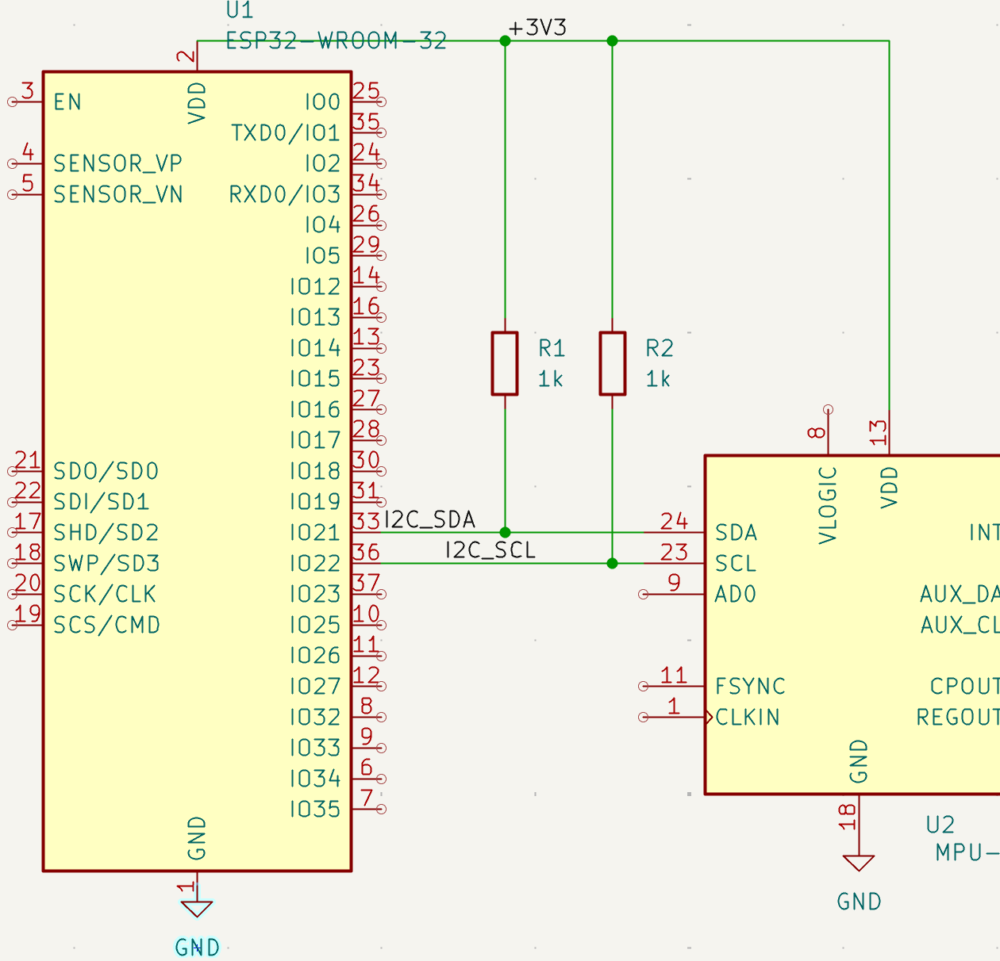
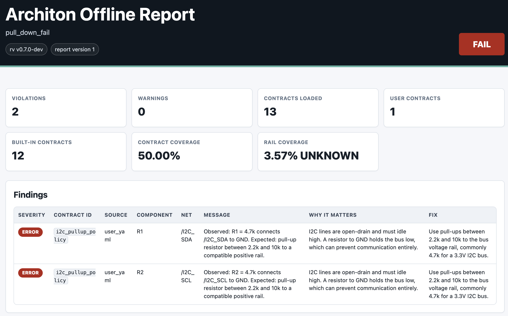
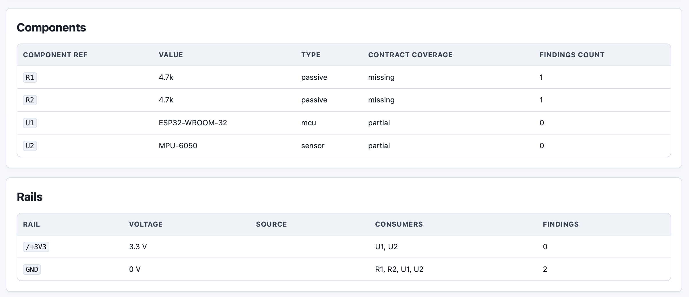

# Architon CLI (rv)

[](https://github.com/badimirzai/architon-cli/actions/workflows/ci.yaml) [](https://github.com/badimirzai/architon-cli/releases/latest) [](https://pkg.go.dev/github.com/badimirzai/architon-cli) [](https://go.dev/dl/) [](https://github.com/badimirzai/architon-cli/blob/main/LICENSE) 
[](docs/mcp.md) [](docs/mcp.md)

Fail fast on hardware integration mistakes before you build the board.

Architon is deterministic hardware architecture verification for robotics and embedded systems. It runs before PCB fabrication and firmware bring-up to catch electrical compatibility, power, logic-level, and integration failures early.

---

## Demo on Real KiCad Project

Architon detects electrical contract violations directly from KiCad projects before bring-up.
Run Architon on a real hardware design and detect an integration failure:


Architon detects integration failures deterministically before hardware is built.


Faulty I2C pull-up configuration in a real KiCad schematic.


**Offline report summary**



**Finding details**



Offline HTML reports show failed contracts, affected nets, electrical impact, and fix guidance.


---

## What Architon verifies

Architon validates system-level compatibility between components, including:

- Supply voltage compatibility
- Explicit power budgets whose source and consumer currents are declared in the contract (`require.power_budget`)
- Driver and motor electrical compatibility
- Power rail capacity and margin
- Logic voltage compatibility
- I2C address conflicts
- Current margin and stall load conditions
- Interface connectivity, including which physical pin lands on each named net (`require.connected` `pins`)

Architon currently focuses on deterministic verification for embedded and robotics electrical architecture, KiCad import, and CI-safe reporting. See [docs/supported-configurations.md](docs/supported-configurations.md).

---

## Why Architon exists

Software has compilers and static analysis.
Hardware lacks a deterministic **system-level** verification step before fabrication.

Architon fills this gap by enforcing architecture contracts across **power, interfaces, and components**. It catches failures that typically appear during bring-up, after hardware has already been built.

**Where Architon fits in the hardware lifecycle:**

```text
Design              Verification        Build              Firmware              Physical
KiCad / Altium  ->  Architon        ->  PCB fabrication -> STM32 / ESP32 / ROS -> Hardware bring-up
```

---

## Quick Start

### Install

Requires Go **1.25.5** or newer (https://go.dev/dl/).

```bash
go install github.com/badimirzai/architon-cli/cmd/rv@latest
rv version
rv doctor
rv --help
```

From a cloned repo, `make install` installs `rv` with Go and runs `rv doctor`:

```bash
git clone https://github.com/badimirzai/architon-cli.git
cd architon-cli
make install
```

`rv scan .` can generate KiCad netlists automatically when `kicad-cli` is on `PATH` or installed in a common KiCad location on macOS, Linux, or Windows. If KiCad is installed somewhere custom, pass `--kicad-cli /full/path/to/kicad-cli`.

### Run with Docker

The container image runs `rv export` with `rv` and KiCad already inside. You only need [Docker Desktop](https://www.docker.com/products/docker-desktop/). From the folder that contains your `.kicad_sch` or `.net` file:

```bash
docker run --rm --pull always --network none -v "$PWD":/project ghcr.io/badimirzai/architon
```

It writes `.architon/studio/report.json` and `.architon/studio/graph.json` and exits with the `rv export` code. `--pull always` fetches the latest release before each run. `--network none` keeps the run offline, which is the supported way to run it. On Linux, add `--user "$(id -u):$(id -g)"` so the image can write to your project. To pin a release, use `ghcr.io/badimirzai/architon:v0.15.0`. See [docs/CLI.md](docs/CLI.md#container-image).

### GitHub Actions for a hardware repository

Copy [`dist/github/architon.yaml`](dist/github/architon.yaml) to `.github/workflows/architon.yaml` in the hardware project. On each pull request and each push to `main`, that workflow checks out the repository and runs `rv export .` in `ghcr.io/badimirzai/architon:v0.17.0`, with the repo mounted at `/project`. It uploads `.architon/studio/report.json` and `.architon/studio/graph.json`, and on a pull request it comments the export exit code and a Studio link for that commit. Update the image pin in `dist/github/architon.yaml` when a release is cut. Details are in [docs/ci.md](docs/ci.md).

[`.github/workflows/architon-example.yml`](.github/workflows/architon-example.yml) remains the workflow for this source repository. It compiles `rv` and scans fixtures.

---

## Scan a real KiCad project (30 seconds)

Try Architon on a real KiCad project:

```bash
git clone https://github.com/badimirzai/architon-kicad-demo.git
cd demos/pull_up_ohms/pull_down_fail
rv init contracts
rv scan .
```

Expected output example:

```text
ARCHITON SCAN
Target: .
Result: FAIL — scan violations detected

Parts: 4
Nets: 56
Rules: 2
Violations: 2

User contracts loaded: 1
Built-in contracts loaded: 12
Active user requirements: 2
Part contract coverage: 50.00%
Parts matched: 2/4

Rule findings:
- ERROR pullup_ohms: Observed: R1 = 4.7k connects /I2C_SDA to GND. Expected: pull-up resistor between 2.2k and 10k to a compatible positive rail.
- ERROR pullup_ohms: Observed: R2 = 4.7k connects /I2C_SCL to GND. Expected: pull-up resistor between 2.2k and 10k to a compatible positive rail.

Generated Netlist: .architon/generated.net
Wrote architon-report.json
exit code: 2
```

`rv scan` can import BOM CSV files, KiCad `.net` netlists, and KiCad project folders. If no netlist exists, Architon can generate `.architon/generated.net` using KiCad CLI. See [docs/importers.md](docs/importers.md).

---

## Ask an agent to verify a design

`rv mcp` lets Cursor or Claude call `verify`, `propose`, and `apply`. `verify` is the same check as `rv scan <path> --format json` and the only pass. It returns `exit_code` and the scan JSON. `propose` and `apply` do not. The server does not draw a schematic, route a PCB, or edit the board except when `apply` adds net labels for an accepted entry.

Build the binary, then open this repo in Cursor. `.cursor/mcp.json` points at `${workspaceFolder}/bin/rv`, so the path is not tied to one machine:

```bash
make build
```

Enable the `architon` server in Cursor, start a new Agent chat, and ask:

```text
Use the architon verify tool on the absolute path of examples/agent-loop/broken.
Do not edit files. Report exit_code and each finding.
```

That fixture exits 2. `examples/agent-loop/fixed` exits 0.

Claude Code, after `make install`:

```bash
claude mcp add --transport stdio architon -- rv mcp
```

Claude Desktop uses its own config and the absolute path from `which rv`. ChatGPT connectors need a remote MCP URL, which this server does not serve. Setup for each client, the tool arguments, and a real KiCad project are in [docs/mcp.md](docs/mcp.md).

---
## CLI usage

Core commands:

```text
rv check <file.yaml>       Run deterministic analysis
rv scan <path>             Import KiCad/BOM data and emit DesignIR report
rv graph <path>            Emit stable GraphIR JSON for Studio/renderers
rv export <path>           Write Studio report and GraphIR under .architon/studio/
rv report <path>           Generate offline HTML reports for review/CI artifacts
rv contracts draft <path>  Write a reviewable contracts draft from a netlist
rv connections propose <path>  Write a reviewable connection proposal from pin functions
rv connections apply <path>    Add net labels for accepted connection entries
rv contracts validate      Validate contracts schema
rv parts list              List built-in contract parts
rv parts show <mpn>        Show one built-in contract part, including cited pin functions
rv init                    Create starter specs and metadata
rv mcp                     Serve verify, propose, and apply for Cursor and Claude
rv version                 Show installed version
```
Detailed CLI examples, scan behavior, import modes, rail inference, and advanced flags are documented in:

- [docs/CLI.md](docs/CLI.md)
- [docs/mcp.md](docs/mcp.md) — local MCP server: `verify`, `propose`, and `apply`, and Cursor and Claude setup
- [docs/contracts.md](docs/contracts.md) — contracts, connection proposals, and the [scan loop](docs/contracts.md#scan-loop) for `rv scan . --format json`
- [docs/ci.md](docs/ci.md) — GitHub Actions and the hardware workflow to copy
- [docs/graph-ir.md](docs/graph-ir.md)
- [docs/importers.md](docs/importers.md)
- [docs/rail-inference.md](docs/rail-inference.md)
- [docs/report-format.md](docs/report-format.md)
---

## Exit codes

`rv check` and `rv scan` return deterministic exit codes designed for CI and automation. Exit codes distinguish between rule findings and tool execution failures.

| Code | Meaning |
|-----:|---------|
| 0 | Clean or informational only. No warnings or violations. |
| 1 | Warnings detected, but no violations. |
| 2 | Rule violations detected. |
| 3 | Tool execution failure, including scan parse errors where analysis could not complete reliably. |

Warnings should be reviewed. CI may allow exit code 1 or treat it as failure using `--warn-as-error`.

For `rv scan`, malformed BOM rows and other parse failures still write a report when possible, then exit 3.

---

## CI integration

Many CI systems fail on any non-zero exit code. To allow warnings but fail on violations:

```yaml
- name: Architon check
  run: |
    rv check robot.yaml
    code=$?
    if [ "$code" -ge 2 ]; then exit "$code"; fi
```

Strict mode, fail on warnings:

```bash
rv check --warn-as-error robot.yaml
```

---

## Deterministic by design

Architon performs deterministic analysis. Rail voltage inference is deterministic and transparent. Each inference includes source, confidence score, evidence, and warnings.

No probabilistic models or network calls are used. Validation operates only on the specification, scan input, metadata, and part data you provide. The same input always produces the same result.

---

## Documentation

Detailed technical documentation is available in `docs/`:

- [docs/architecture.md](docs/architecture.md) — engine architecture and system design
- [docs/ci.md](docs/ci.md) — GitHub Actions, the hardware workflow to copy, PR comments, and scan artifacts
- [docs/contracts.md](docs/contracts.md) — built-in and user system contracts, and the [scan loop](docs/contracts.md#scan-loop)
- [docs/importers.md](docs/importers.md) — KiCad/BOM/netlist import behavior
- [docs/rail-inference.md](docs/rail-inference.md) — rail voltage inference and coverage
- [docs/report-format.md](docs/report-format.md) — JSON report schema and compatibility notes
- [docs/spec.md](docs/spec.md) — YAML architecture specification and parts lookup
- [docs/supported-configurations.md](docs/supported-configurations.md) — supported and unsupported configurations
- [docs/rules.md](docs/rules.md) — deterministic rule system and validation logic

---

## Contributing

Open an issue before starting work so scope can be aligned.

Contributors retain copyright to their work. By contributing, you agree to the CLA in [CLA.md](CLA.md), which grants the project maintainer rights to relicense contributions.

---

## Status

Early alpha. Interfaces and rule coverage evolving toward `v1.0`.

---

## License

Licensed under the GNU AGPLv3.

See [LICENSE](LICENSE) for details.

---

## Disclaimer

This tool does not replace datasheets or engineering judgement.
Not suitable for safety critical systems.
Use at your own risk.
